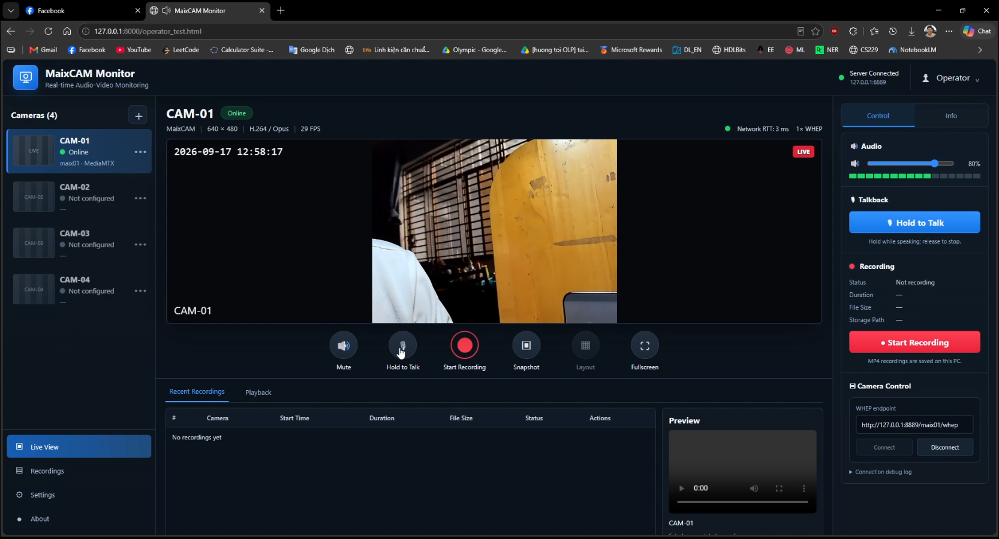

# WorkerCam Admin / MaixCAM RTSP operator

This project relays MaixCAM video and PC talkback to a local web operator page. Earbuds → MaixCAM → PC microphone audio remains unimplemented end to end. The PC side runs MediaMTX, FFmpeg, recording, and the operator server, either natively on Windows or in a Linux container. MaixCAM keeps its camera and Bluetooth programs on the physical device.

The operator page is now a React/TypeScript WorkerCam Admin interface with Live Workers, Recordings, and Settings. Sign in with `admin` / `admin`. Worker #07 connects to the physical camera; Worker #12 is a local demo. Login and the generic worker database are frontend prototypes (sessionStorage and IndexedDB); server authentication and database APIs remain future backend work. See [frontend/README.md](frontend/README.md) for development, data boundaries, and API integration.

## Directory layout

```text
maix-cam-server/
├── maix/                 MaixCAM programs
│   ├── rtsp_av.py         Camera video RTSP publisher
│   ├── bluetooth_audio.py
│   ├── headset_mic_stream.py  headset mic publisher to laptop MediaMTX
│   ├── talkback_receiver.py
│   ├── rtsp_app.yaml       Maix app metadata for RTSP auto-start
│   └── background_services.rc.local
├── pc/                   Windows operator and relay scripts
│   ├── operator_server.py
│   ├── operator_test.html  Compiled WorkerCam Admin UI
│   ├── run_publisher.ps1
│   └── talkback.py
├── recordings/           MP4 files and recording metadata
├── frontend/             React/TypeScript UI source and browser tests
├── tests/
├── Dockerfile            PC server image
├── compose.yaml          PC server deployment
├── app.py                PC server supervisor
├── upload_maix.ps1       PuTTY upload script for camera programs and token
└── mediamtx.yml
```

## Current configuration: TCP video-only

The saved local `.env` selects the low-delay video configuration tested on
2026-10-10:

```dotenv
RTSP_TRANSPORT=tcp
STREAM_MODE=video
```

MaixCAM video reaches PC FFmpeg over RTSP/TCP, is copied as H.264 to MediaMTX
over RTSP/TCP, and reaches the admin browser through WebRTC/WHEP over UDP.
Headset microphone audio is excluded from the monitored stream and recordings
in this mode. Browser WHIP talkback and the sequenced-UDP camera relay remain
available; they are independent of microphone monitoring.

The physical Edge stopwatch pilot measured 230 ms median and 240 ms p95 with
seven clear samples. These are provisional results, not a latency guarantee.
UDP video-only was also fast; the test does not establish TCP as the cause.
The user reports acceptable video and PC talkback latency. Keep this
configuration while implementing the earbuds microphone path separately.
See [measurements and limitations](docs/rtsp-measurements.md).

## Run the configured stack

**Current Windows runtime (2026-10-10, approximately 19:19): native `app.py`.**
Docker Desktop's operator page returned HTTP 200 inside the container but Windows
could not reach localhost ports 8000 or 8889. Restarting Desktop and recreating
the operator container did not resolve access. The operator container is now
stopped, and the native Windows stack is running in TCP video-only mode.
ThingsBoard and PostgreSQL were restored after the restart; PostgreSQL was healthy.

Open **http://127.0.0.1:8000/operator_test.html**, sign in with **admin / admin**,
and select **Worker #07**. The filename is `operator_test.html`, not
`operaator_test.html`. The operator page runs on the PC and can load while
MaixCAM is offline. MaixCAM must provide its existing video and talkback services
for those features; no additional camera program is needed just to open the page.

For daily startup from the project root, with Python, FFmpeg on `PATH`, and
`mediamtx.exe` beside `app.py`, run:

```powershell
.\start_operator.ps1
```

The helper reads `MAIX_IP`, `RTSP_TRANSPORT`, and `STREAM_MODE` from `.env`
(defaults: `192.168.1.7`, TCP, video-only). It stops only the project's Docker
operator when needed, reuses an already-running native operator with matching
settings, otherwise starts it hidden, and verifies Windows HTTP access before
reporting success. Docker is not required for native startup. It preserves other
containers and does not start camera programs. Use `-Build` to rebuild the
frontend after UI changes; Node/npm are required for that option.

Stop a recording in the UI, then stop the native stack with:

```powershell
.\stop_operator.ps1
```

The stop helper refuses to stop during an active recording. For a manual
foreground launch after stopping any existing stack:

```powershell
docker compose -f compose.yaml -f compose.host.yaml stop server
python app.py --maix-ip 192.168.1.7 --rtsp-transport tcp --stream-mode video
```

Direct native Python does not automatically load Compose's `.env`; use the
explicit flags above, or the startup helper. Stop a foreground native run with
**Ctrl+C**. The current session
was launched hidden, with its PID and logs in `.runtime/operator-native.pid`,
`.runtime/operator-native.stdout.log`, and `.runtime/operator-native.stderr.log`.
Do not start a second stack while it is running. Before returning to Docker,
run `.\stop_operator.ps1` to stop the native supervisor and its MediaMTX/FFmpeg
children, and confirm the ports are free. Do not stop unrelated Python or media processes.

The workaround passed Windows HTTP 200, camera TCP packet reception, H.264
publication on `/maix01`, and a talkback API availability check. Browser playback
and audible talkback were not physically retested after this switch. See the
[session evidence](docs/sessions/2026-10-10-rtsp-latency.md).

For Docker installation and the unresolved Windows access issue, use the
[Docker run guide](docs/docker-run-guide.md). `./start_docker.ps1` (or `-Build`
after code changes) remains the Docker helper, but is not the current working
Windows startup route. It applies VM UDP buffer limits and starts host mode,
refuses to run alongside the native operator, and reports failure if Windows
cannot reach the page. On that failure, run `.\start_operator.ps1`.
Keep `.env` set to TCP/video when testing Docker again.

Read [the protocol map and deployment history](docs/udp-media.md) before updating
the physical device. Existing microphone scripts and earlier RTP checks do not
establish a completed earbuds → MaixCAM → PC audio feature.

On Linux, use Docker host networking for RTSP/RTP UDP. Provision matching PC/camera talkback token files before starting. From the project root, run:

```powershell
docker compose -f compose.yaml -f compose.host.yaml up --build -d
```

Open `http://127.0.0.1:8000/operator_test.html`, sign in, and the physical MaixCAM feed connects automatically. RTSP signaling and current TCP-interleaved media use TCP 8554; UDP RTSP mode uses RTP/RTCP ports 8002/8003. WebRTC media uses UDP 8189; HTTP signaling uses 8889. The base Compose file maps these ports, but Windows Docker Desktop bridge/NAT failed actual RTP delivery in validation. Use the configured host-network override on this machine. TCP is explicitly selected, not an automatic fallback. The container reads `.talkback_token` without copying it into the image and saves MP4 files in the host's `recordings/` folder. Set `MAIX_IP` before `docker compose up` if the camera IP differs from `192.168.1.7`.

The publisher takes video from `rtsp://<MaixIp>:8554/live` and publishes `/maix01` with the tracks selected by `STREAM_MODE`. Combined mode additionally reads microphone audio from `/headsetmic` or the configured direct RTP input. The operator page derives its WHEP address from the browser host. The container restarts automatically if it exits; the supervisor also restarts FFmpeg when the input stream drops. For Docker logs or shutdown, use `docker compose -f compose.yaml -f compose.host.yaml logs -f server` or `docker compose -f compose.yaml -f compose.host.yaml down`. Stop any earlier native stack before starting Docker because both use the same ports.

To run the PC side without Docker on Windows, keep `mediamtx.exe` beside `app.py`, install FFmpeg on `PATH`, and use the explicit native video-only command above. This is an alternative to Compose, not an additional service.

**Start Recording** saves MP4 files to `recordings/` under this project root, regardless of the terminal's current directory. Video is copied as H.264; when microphone monitoring is enabled, audio is converted from Opus to AAC. Current video-only recordings have no microphone audio. Stop recording to finalize the file before playback. The UI reports a relative storage path such as `recordings/20260917T054224Z_be738304.mp4`. To choose another directory, pass `--recordings <relative-path>`; relative paths are resolved from the project root.

The publisher and recorder remove empty H.264 NAL units emitted by this MaixCAM. The Docker image includes FFmpeg and the same `app.py` supervisor. Run the tests with `python -m unittest discover -s tests -v`.

## MaixCAM program

The microphone behavior described below reflects existing code and earlier
deployment experiments. Earbuds → MaixCAM → PC audio remains unimplemented
end to end according to the latest user status. Keep current camera video and
talkback services; do not redeploy them just to open the operator page.

`maix/rtsp_av.py` supplies 640 × 480 camera video to the PC publisher; it does not capture the built-in microphone. `maix/headset_mic_stream.py` captures the selected headset's microphone through BlueALSA and publishes it to `rtsp://192.168.1.4:8554/headsetmic`. If the laptop IP changes, update `--target` in `maix/background_services.rc.local` and reinstall that boot script. The headset microphone must support the 8 kHz hands-free profile and stereo playback. While Hold to Talk is pressed, MaixCAM pauses headset mic capture, plays PC audio through its stereo profile, and publishes silence on `/headsetmic` so the video stream stays live. Headset mic capture resumes on release.

For two-way voice, copy `pc/talkback_protocol.py` beside `maix/talkback_receiver.py` on the camera, and copy `maix/bluetooth_audio.py`, `maix/bluetooth_control.py`, and `maix/headset_mic_stream.py` to MaixCAM. The startup template binds MaixCAM to its fixed earbuds using `--fixed-mac`. The Bluetooth address is saved in `/root/.bluetooth_device` and survives reboot. The audio service enables the hands-free audio-gateway profiles, trusts the earbuds, and retries connection every five seconds. No scan or device choice is required each session. The admin interface shows connection status and prevents switching to other earbuds. For initial pairing, put the bound earbuds in pairing mode. If they are unavailable, microphone streaming supplies silence while connection retries continue. The authenticated Bluetooth status service remains on TCP 8765. Do not start a second talkback receiver on UDP 9002. The boot script sets `HOME=/root` so ALSA can read `/root/.asoundrc`.

Browser talkback now sends WebRTC audio through WHIP; HTTP carries SDP and stop control only. The PC sends HMAC-authenticated TB2 datagrams to MaixCAM with session IDs, sequence numbers, timestamps, bounded jitter buffering, and stale-packet dropping. Synchronize PC/camera clocks within two seconds. Update the PC and camera receiver together: TB1 packets are rejected.

The PC operator reads the repository's `.talkback_token`, while the camera receiver and Bluetooth control service read `/root/.talkback_token`. They must contain the same value. The repository also includes `auto.key`; Docker does not use it. Hold **Hold to Talk** while speaking; release it to stop. If talkback is unavailable, check `GET /api/talkback/status`, the camera's UDP port 9002, and its receiver log. If device scanning fails, check TCP 8765 connectivity and `/root/bluetooth-audio.log` on the camera.

The operator server serves the page, recording API, talkback API, Bluetooth control API, and MP4 files. `app.py` runs that server as part of the host stack.

## Copy and run on MaixCAM (192.168.1.7)

For a new or reset MaixCAM, install PuTTY and put `plink` and `pscp` on `PATH`. From PowerShell on the laptop, upload the MaixCAM programs, app metadata, background startup template, and included token. The script uses the project root for source files even if launched from another directory. The MaixCAM root password is `root` on this device. This transport migration requires updating the microphone publisher, talkback receiver, and shared protocol module together after local verification.

```powershell
./upload_maix.ps1 -MaixHost 192.168.1.7 -Password root -HostKey 'SHA256:MMjQMht0IcoEBBkw5OVPuwa2wrbSHpiEYHn27tdGcmY'
```

PuTTY batch mode needs a trusted host key. The `-HostKey` value above pins the fingerprint reported by your MaixCAM; check it again if the device's SSH key changes. You can use `-KeyPath` instead of `-Password` if SSH key authentication is configured. The script validates all files before upload, backs up every existing target into a private timestamped directory before overwriting, and checks each remote command. It uploads files only; restart the MaixCAM programs after updating them. If Windows blocks the script as unsigned, run `Set-ExecutionPolicy -Scope Process Bypass` in that terminal first.

Use the Maix [app auto-start mechanism](https://en.wiki.sipeed.com/maixpy/doc/en/basic/auto_start.html) for RTSP. The built-in `rtsp_stream` app fails on this device because it tries to open a touchscreen, so install the supplied touchscreen-free app. These commands do not edit `/etc/init.d`:

```powershell
plink -batch -hostkey 'SHA256:MMjQMht0IcoEBBkw5OVPuwa2wrbSHpiEYHn27tdGcmY' -pw root root@192.168.1.7 'mkdir -p /maixapp/apps/maix_rtsp && cp /root/rtsp_av.py /maixapp/apps/maix_rtsp/main.py && cp /root/rtsp_app.yaml /maixapp/apps/maix_rtsp/app.yaml && python3 /maixapp/apps/gen_app_info.py /maixapp/apps && printf maix_rtsp > /maixapp/auto_start.txt'
```

For Bluetooth and talkback, back up the current `/etc/rc.local`, then copy the supplied template. It starts only background audio processes; the camera stays under the app launcher:

```powershell
plink -batch -hostkey 'SHA256:MMjQMht0IcoEBBkw5OVPuwa2wrbSHpiEYHn27tdGcmY' -pw root root@192.168.1.7 'cp -p /etc/rc.local /etc/rc.local.maixcam-original && cp /root/background_services.rc.local /etc/rc.local && sh -n /etc/rc.local && reboot'
```

After boot, `rtsp://192.168.1.7:8554/live` should serve camera video, UDP 9002 should have one talkback receiver, and `/root/headset-mic-stream.log` should show the headset mic publisher retrying until the laptop relay starts. Do not launch duplicate copies in SSH terminals. Power on the bound earbuds and release their connection to another device; MaixCAM retries automatically. To replace the earbuds deliberately, update `--fixed-mac` in the startup template, reinstall it, and restart the Bluetooth and microphone services. To disable RTSP auto-start, remove `/maixapp/auto_start.txt` and reboot. To restore the original background startup file, copy `/etc/rc.local.maixcam-original` back to `/etc/rc.local` and reboot. A firmware reflash changes the SSH host key, so verify the new fingerprint before using these commands.

## Demo



- Currently, only recording, talkback, and Bluetooth control are implemented. The operator page can be extended with additional features.

## USB diagnostic fallback

MaixCAM's verified USB addresses are `10.172.16.1` (NCM / usb1) and `10.172.17.1` (RNDIS / usb0). The PC uses `.100` on those subnets. The default diagnostic fallback is `10.172.16.1`; override with `MAIX_USB_IP` or `--maix-usb-ip`.

Open **Settings → Camera Diagnostics → Diagnose camera**, or run `python -m pc.camera_diagnostics`. Diagnostics check SSH (22), RTSP control (8554), and Bluetooth control (8765) on Wi-Fi, then on USB if all Wi-Fi service checks fail. TCP reachability does not verify UDP media delivery. Media continues to use `MAIX_IP`; USB provides access for diagnosis. The deployed camera has a working RTSP listener and verified UDP video delivery to the native PC stack.
## RTSP transport selection

The code defaults remain UDP and combined; this machine's saved `.env` overrides
them with TCP and video-only. Select `python app.py --rtsp-transport tcp --stream-mode video` to use
TCP-interleaved media; startup verifies actual camera video packets before
replacing the running stack. Use `--stream-mode video|audio|combined` for isolated
inputs. The camera headset publisher must use the matching transport; direct
RTP audio remains UDP. Browser WebRTC and sequenced-UDP talkback are preserved.
See [configuration and measurement instructions](docs/rtsp-transport.md).
